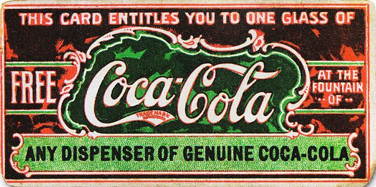
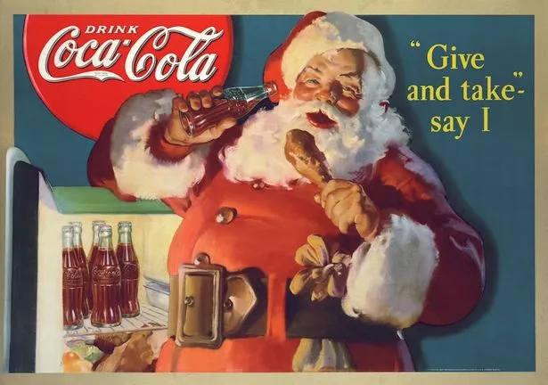
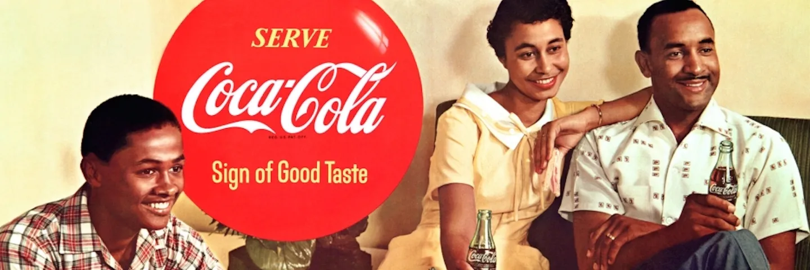
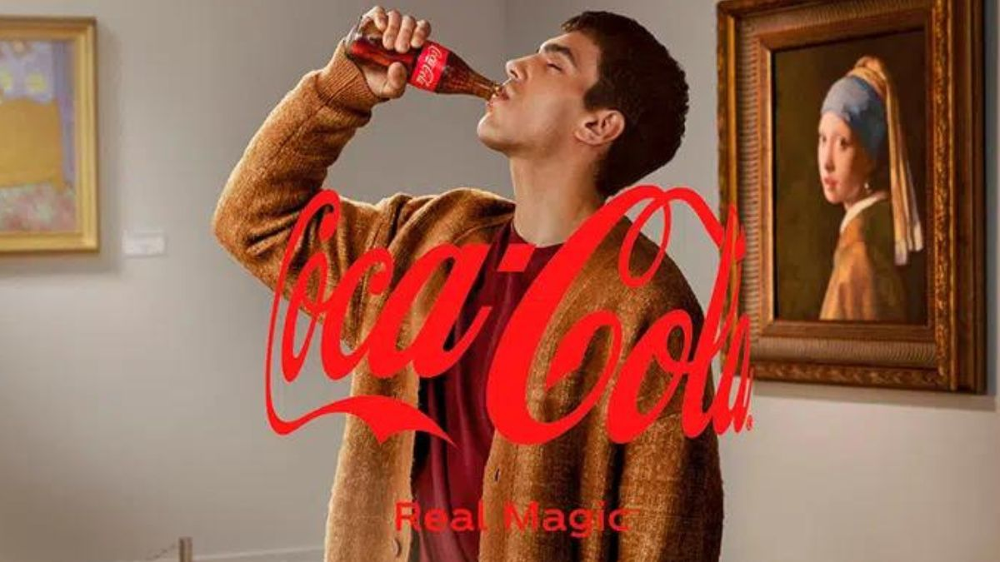
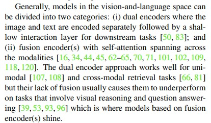

</a>

<table>
  <thead>
    <tr>
      <th>Python File</th>
      <th>Info</th>
    </tr>
  </thead>
  <tbody>
    <tr>
      <td></td>
      <td>🌋 ImageBind</td>
    </tr>
    <tr>
      <td></td>
      <td>🌋 ALIGN</td>
    </tr>
    <tr>
      <td></td>
      <td>🌋 QWEN-VL</td>
    </tr>
  </tbody>
</table>

# ✨ Introduction to Ad Creative Recognition Solution

Personalized advertisement is a crucial task for many of the online businesses and video broadcasters. It indeed is a pivotal strategy through which businesses try to connect with their audience in a meaningful way, drive engagement and conversions, and stay ahead in today's dynamic digital landscape

## ✨ Problem Statement
The primary objective is to develop a robust computer vision model proficient 
in accurately classifying images into two distinct categories: ad creatives and non-ad creatives

### ⚡️ Why not CNNS ?
Convolutional Neural Networks (CNNs) are the go-to choice for image classification tasks. However, CNNs would not be the best choice for this. This is partly due to limitations in available datasets and the computational resources required for training CNNs but this isn't the only reason.
Well, advertisements have evolved over the years and have become more complex. 
They are no longer just images or simply texts but a combination of images, text,
and other elements.
They are not able to capture the semantic meaning of the text
let's consider the evolution of Coca-Cola advertisements over time. 
By examining the progression of their ad campaigns, we can observe the changing 
dynamics and complexities inherent in modern advertising

]

## ️✨️ FUSED MULTIMODAL 

### ⚡ QWEN-VL CHAT 
- **Text Encoder:** BERT  
- **Visual Encoder:** EfficientNet  

Feature Extraction by QWEN_VL for the following

## ✨ Zero-shot

### ✨ ALIGN 
**Text Encoder:** BERT  
**Visual Encoder:** EfficientNet  

| Model        | Accuracy | Recall |
|--------------|----------|--------|
| Model 1      | 0.85     | 0.90   |

### ✨ ImageBind 
TLDR: Single embedding model for 6 different modalities with zero-shot and few-shot recognition

META's ImageBind is beter than the dual encoder architecture as cited by 

| Model        | Accuracy | Recall |
|--------------|----------|--------|
| Model 1      | 0.85     | 0.90   |
