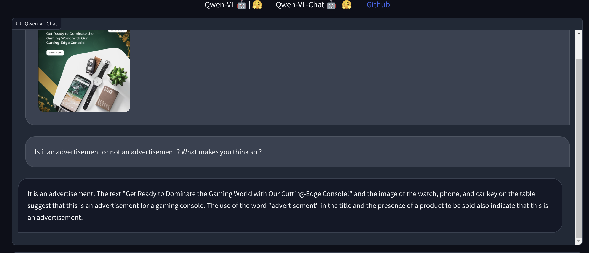

</a>

<table>
  <thead>
    <tr>
      <th>Python File</th>
      <th>Info</th>
    </tr>
  </thead>
  <tbody>
    <tr>
      <td></td>
      <td>🌋 ImageBind</td>
    </tr>
    <tr>
      <td></td>
      <td>🌋 ALIGN</td>
    </tr>
    <tr>
      <td></td>
      <td>🌋 QWEN-VL</td>
    </tr>
  </tbody>
</table>

# ✨ Introduction to Ad Creative Recognition Solution

Personalized advertisement is a crucial task for many of the online businesses and video broadcasters. It indeed is a pivotal strategy through which businesses try to connect with their audience in a meaningful way, drive engagement and conversions, and stay ahead in today's dynamic digital landscape

## ✨ Problem Statement
The primary objective is to develop a robust computer vision model proficient 
in accurately classifying images into two distinct categories: ad creatives and non-ad creatives

### ⚡️ Why not CNNS ?
- **Limitations in Dataset and Resources**: CNNs aren't the optimal choice due to constraints in available datasets and the computational resources required for training.

- **Complexity of Modern Advertisements**: Advertisements have evolved beyond simple images or text, now incorporating a combination of images, text, and other elements, making it challenging for CNNs to accurately interpret them.

- **Semantic Understanding**: CNNs struggle to capture the semantic meaning of text within advertisements, limiting their ability to comprehend the full context and message conveyed.

]

## ️✨️ FUSED MULTIMODAL 

### ⚡ QWEN-VL CHAT (For Feature Extraction)
- **Text Encoder:** QWEN  
- **Visual Encoder:** ViT  

Feature Extraction by QWEN_VL for the following

## ✨ Zero-shot

### ✨ ALIGN 
**Text Encoder:** BERT  
**Visual Encoder:** EfficientNet  

| Model        | Accuracy | Recall |
|--------------|----------|--------|
| Model 1      | 0.84     | 0.90   |

### ✨ ImageBind 
TLDR: Single embedding model for 6 different modalities with zero-shot and few-shot recognition

META's ImageBind is beter than the dual encoder architecture as cited by 

| Model        | Accuracy | Recall |
|--------------|----------|--------|
| Model 1      | 0.96     | 0.95   |
